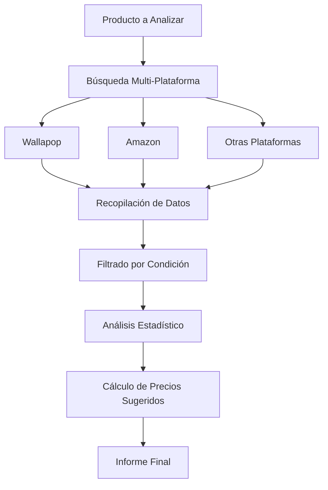

# 📊 Sistema de Análisis de Precios Competitivos

## 📋 Descripción General

El sistema de análisis de precios permite establecer precios óptimos para tus productos comparando automáticamente con:
- 🟦 **Wallapop** - Competencia directa
- 🟧 **Amazon** - Precio de referencia nuevo
- 🟥 **eBay** - Mercado internacional
- 🟪 **Milanuncios** - Alternativa nacional
- 🟩 **Vinted** - Especializado en ropa

## 🎯 Funcionalidades Principales

### 1. **Análisis de Mercado**
- Búsqueda automática de productos similares
- Filtrado por condición (nuevo, usado, etc.)
- Análisis estadístico de precios
- Detección de tendencias del mercado

### 2. **Sugerencias de Precio**
- **Precio Sugerido**: Óptimo para venta equilibrada
- **Precio Competitivo**: Para venta rápida (percentil 25)
- **Precio Premium**: Para maximizar ganancia (percentil 75)

### 3. **Métricas Avanzadas**
- Distribución de precios por rangos
- Confianza en el análisis (0-100%)
- Tendencia del mercado (subiendo/bajando/estable)
- Comparación con precios de referencia

## 🔧 Arquitectura del Sistema

```
price_analyzer/
├── analyzer.py           # Motor principal de análisis
├── scrapers/
│   ├── wallapop_scraper.py   # Scraper de Wallapop
│   ├── amazon_scraper.py     # Scraper de Amazon
│   ├── ebay_scraper.py       # Scraper de eBay
│   ├── milanuncios_scraper.py # Scraper de Milanuncios
│   └── vinted_scraper.py     # Scraper de Vinted
└── models.py            # Modelos de datos
```

## 📊 Flujo de Análisis



## 🚀 Uso del Sistema

### Ejemplo Básico
```python
from price_analyzer import PriceAnalyzer

analyzer = PriceAnalyzer()

# Analizar precio de un iPhone 12
analysis = await analyzer.analyze_product_price(
    product_name="iPhone 12 128GB",
    product_condition="buen estado",
    include_shipping=True,
    location="Madrid"
)

print(f"Precio sugerido: {analysis.suggested_price}€")
print(f"Para venta rápida: {analysis.competitive_price}€")
print(f"Confianza: {analysis.confidence_score}%")
```

### Ejemplo Avanzado con Monitoreo
```python
# Monitorear cambios de precio
urls_to_monitor = [
    "https://es.wallapop.com/item/iphone-12-12345",
    "https://es.wallapop.com/item/iphone-12-67890"
]

await analyzer.monitor_price_changes(
    product_urls=urls_to_monitor,
    interval_hours=12  # Verificar cada 12 horas
)
```

## 📈 Interpretación de Resultados

### Estructura de PriceAnalysis
```python
{
    "avg_price": 450.00,           # Precio promedio
    "median_price": 440.00,        # Precio mediano (más estable)
    "min_price": 350.00,           # Precio mínimo encontrado
    "max_price": 600.00,           # Precio máximo encontrado
    "suggested_price": 425.00,     # PRECIO RECOMENDADO
    "competitive_price": 400.00,   # Para venta en <24h
    "premium_price": 475.00,       # Para maximizar beneficio
    "total_listings": 45,          # Total de anuncios analizados
    "active_listings": 38,         # Anuncios activos (no vendidos)
    "price_distribution": {        # Distribución por rangos
        "300-400": 12,
        "400-500": 25,
        "500-600": 8
    },
    "market_trend": "estable",     # Tendencia: subiendo/bajando/estable
    "confidence_score": 85.0       # Confianza en el análisis
}
```

### Niveles de Confianza
- **90-100%**: Análisis muy fiable (>20 muestras + datos Amazon)
- **70-89%**: Análisis fiable (10-20 muestras)
- **50-69%**: Análisis moderado (5-10 muestras)
- **<50%**: Análisis con poca confianza (<5 muestras)

## 🎯 Estrategias de Precio

### 1. **Venta Rápida** (1-3 días)
```python
precio = analysis.competitive_price  # Percentil 25
# Ejemplo: Si la mediana es 450€, precio competitivo ~400€
```

### 2. **Venta Equilibrada** (1 semana)
```python
precio = analysis.suggested_price  # 95% de la mediana
# Ejemplo: Si la mediana es 450€, precio sugerido ~427€
```

### 3. **Maximizar Beneficio** (2+ semanas)
```python
precio = analysis.premium_price  # Percentil 75
# Ejemplo: Si la mediana es 450€, precio premium ~500€
```

## 🔍 Factores de Ajuste de Precio

### Por Condición (vs Precio Nuevo Amazon)
- **Nuevo/Precintado**: 90-95% del precio Amazon
- **Como Nuevo**: 75-80% del precio Amazon
- **Buen Estado**: 60-65% del precio Amazon
- **Usado**: 45-50% del precio Amazon

### Por Urgencia de Venta
- **Muy Urgente**: -15% del precio sugerido
- **Urgente**: -10% del precio sugerido
- **Normal**: Precio sugerido
- **Sin Prisa**: +5-10% del precio sugerido

### Por Temporada
- **Alta Demanda**: +10-20% (Navidad, Black Friday)
- **Demanda Normal**: Precio base
- **Baja Demanda**: -10-15% (verano para electrónica)

## 🛡️ Consideraciones de Seguridad

### Rate Limiting
- Wallapop: Máximo 1 request/segundo
- Amazon: Máximo 1 request/2 segundos
- Rotación de User-Agents
- Uso de proxies si es necesario

### Detección de Anomalías
```python
# El sistema detecta y filtra:
- Precios irrealmente bajos (<10% de la mediana)
- Precios irrealmente altos (>300% de la mediana)
- Anuncios duplicados
- Vendedores sospechosos
```

## 📊 Dashboard de Precios (Futuro)

```python
# Visualización en tiempo real
- Gráfico de evolución de precios
- Heatmap de precios por zona
- Alertas de cambios significativos
- Comparativa con competencia directa
```

## 🔧 Configuración Avanzada

```yaml
# config/price_analyzer.yaml
price_analyzer:
  # Plataformas a analizar
  platforms:
    wallapop: true
    amazon: true
    ebay: false
    milanuncios: false
    vinted: false
  
  # Configuración de análisis
  analysis:
    min_samples: 5          # Mínimo de muestras para análisis
    max_samples: 50         # Máximo de muestras por plataforma
    outlier_threshold: 0.3  # 30% de desviación para outliers
    
  # Ajustes de precio
  pricing:
    competitive_percentile: 25
    premium_percentile: 75
    quick_sale_discount: 0.95  # 5% descuento
    
  # Caché
  cache:
    enabled: true
    ttl_hours: 24  # Tiempo de vida del caché
```

## 🚀 Próximas Mejoras

1. **Machine Learning**
   - Predicción de tiempo de venta según precio
   - Detección automática de chollos
   - Optimización dinámica de precios

2. **Análisis Visual**
   - Comparación de imágenes con IA
   - Detección de estado real del producto
   - Verificación de autenticidad

3. **Integración con Bot**
   - Ajuste automático de precios
   - Alertas de competencia
   - Re-pricing dinámico

## 💡 Tips y Mejores Prácticas

1. **Actualiza precios regularmente** (cada 3-7 días)
2. **Considera los gastos de envío** en tu estrategia
3. **Analiza a tu competencia directa** (misma zona)
4. **Ajusta por temporada** (electrónica en Black Friday)
5. **Sé flexible** - Si no vendes en 1 semana, baja 5-10%

---

El sistema de análisis de precios es una herramienta poderosa para maximizar tus ventas en Wallapop manteniéndote siempre competitivo. 📈
