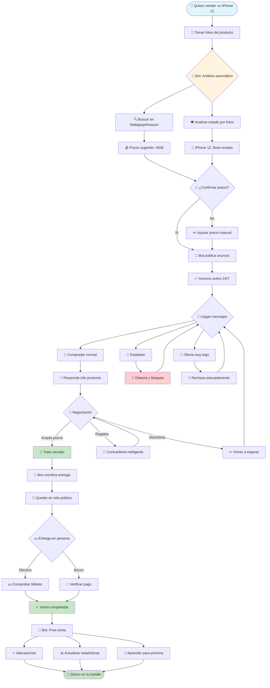

# 🔄 Diagrama de Flujo Visual - Sistema de Venta Automatizada

## 🕐 Timeline Típico

| Día | Actividad | Tiempo tuyo | Bot trabajando |
|-----|-----------|-------------|----------------|
| **0** | 📸 Fotos + Publicar | 15 min | ✅ Análisis precio |
| **1-3** | Nada | 0 min | 💬 Responde 20-30 mensajes |
| **4** | 📱 Ver notificación venta | 2 min | 🤝 Cierra trato |
| **5** | 🤝 Entregar producto | 30 min | 📊 Actualiza stats |
| **Total** | - | **~47 min** | **24/7 activo** |

## 🤖 Lo que hace el Bot vs 👤 Lo que haces tú

### 🤖 Bot (Automático 24/7):
- ✅ Analiza precios del mercado
- ✅ Publica el anuncio optimizado  
- ✅ Responde TODOS los mensajes
- ✅ Detecta y bloquea estafadores
- ✅ Negocia precios inteligentemente
- ✅ Coordina lugar y hora
- ✅ Gestiona valoraciones
- ✅ Aprende de cada venta

### 👤 Tú (Manual ~45 min total):
- ✅ Tomar fotos del producto
- ✅ Confirmar precio sugerido
- ✅ Ir al punto de encuentro
- ✅ Verificar el pago
- ✅ Entregar el producto

## 💰 Ejemplo Real: Venta de iPhone 12

### Sin Bot (Método tradicional):
- ⏱️ **Tiempo dedicado**: 5-10 horas
- 💬 **Mensajes respondidos**: 20-30 manualmente  
- 😩 **Estrés**: Alto (spam, regateos, estafas)
- 💸 **Precio final**: 400€ (cediste por cansancio)
- 📅 **Días hasta venta**: 10-15 días

### Con Bot (Automatizado):
- ⏱️ **Tiempo dedicado**: 45 minutos
- 💬 **Mensajes gestionados**: 50+ automáticamente
- 😌 **Estrés**: Mínimo (solo la entrega)
- 💸 **Precio final**: 435€ (negociación óptima)
- 📅 **Días hasta venta**: 4-5 días

### 📊 Resultado:
- **+35€** más de beneficio
- **-9 horas** de trabajo
- **-10 días** de espera
- **0 estafadores** que gestionar

## 🚀 Escalabilidad

### Con 1 producto:
- 45 min de tu tiempo
- 435€ de ingreso

### Con 10 productos simultáneos:
- ~2 horas de tu tiempo total
- ~4,350€ de ingresos potenciales
- Bot gestiona 500+ conversaciones
- Sin volverse loco 😅

## 🎯 Casos de Uso Perfectos

1. **📱 Vendedor ocasional**: Vendes 2-3 cosas al año
2. **🏪 Pequeño negocio**: 10-20 productos mensuales
3. **♻️ Revendedor**: Compra-venta continua
4. **🏠 Mudanza**: Vender muchas cosas rápido
5. **👨‍👩‍👧‍👦 Familia**: Ropa/juguetes niños que ya no usan

## ⚠️ Limitaciones Actuales

- ❌ No puede valorar estado físico (necesitas tú)
- ❌ No puede hacer la entrega física
- ❌ No puede verificar billetes falsos
- ❌ No gestiona devoluciones/garantías

## 🔮 Futuras Mejoras

1. **📸 IA Visual**: Valorar estado por fotos automáticamente
2. **🚚 Integración envíos**: Generar etiquetas automáticas
3. **💳 Pagos digitales**: Verificación automática Bizum
4. **📱 App móvil**: Notificaciones push en tiempo real
5. **🌐 Multi-plataforma**: Vender en Vinted, eBay, etc. simultáneamente
